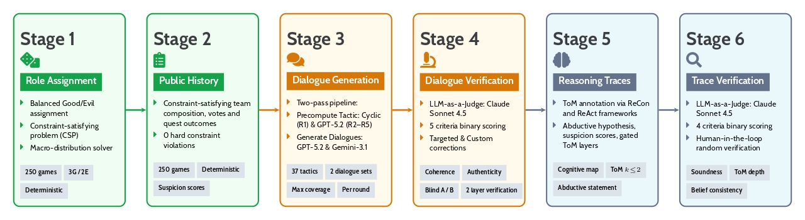

# AVCORP: Avalon Deception Corpus

**AVCORP** is an annotated dataset of 1,000 AI-generated discussion logs from 250 five-player *The Resistance: Avalon* games, where each of the 3,900 contextual-agent utterances is labeled with one of 37 deception or cooperation tactics from a theory-grounded 4×4 behavior matrix (IDT, TDT, IMT2), verified by a blind LLM judge, and augmented with Theory of Mind reasoning traces.



---

## Directory Structure

```
Avalon-deception/
├── dataset-aug.ipynb                   # S1: Role assignment
├── dataset-aug-public-history.ipynb    # S2: Public history generation
├── log-gen-r{1..5}.ipynb               # S3: Dialogue generation
├── log-gen-summarizer.ipynb            # S3: Round summarizer 
├── log-gen-verifier-r{1..5}.ipynb      # S4: LLM-as-Judge verification 
├── log-gen-reasoner.ipynb              # S5: Theory of Mind reasoning traces
├── log-gen-reasoner-verifier.ipynb     # S6: Trace verification
├── Deception-Dataset.csv               # Master dataset (250 games)
├── tactics_knowledge_base.json         # 4×4 behavior matrix (37 tactics)
├── llm.py                              # OpenAI GPT-5.2/GPT-5.4 wrapper
├── gemini.py                           # Google Gemini-3.1 wrapper
├── requirements-seed-generation.txt
├── Datasets/
│   ├── role_history/                   # Role assignments & public histories 
│   ├── seeds/                          # Raw generated dialogues
│   ├── summarizer/                     # Round summaries
│   ├── verified/                       # Verified dialogues & criteria scores
│   └── reasoning/                      # ToM reasoning traces
└── fig/                               
```

---

## Installation

```bash
pip install -r requirements-seed-generation.txt
```

Create a `.env` file in the project root:

```
OPENAI_API_KEY=your_key
GEMINI_API_KEY=your_key
ANTHROPIC_API_KEY=your_key
```

---

## Dataset Construction Pipeline

Six sequential stages build the full dataset, from role assignments through verified Theory of Mind traces.

```
S1:Roles  ──►  S2:History  ──►  S3:[log-gen-r{n}]  ──►  S4:[verifier-r{n}] → [summarizer]  ──►  S5:[reasoner] ──►  S6:[reasoner-verifier]
```

**Example for Round 2:**
```
log-gen-r2.ipynb          →  generates Datasets/seeds/generated_r2_seeds_{model}.csv
log-gen-verifier-r2.ipynb →  generates Datasets/verified/verified_r2_seeds_combined.csv
log-gen-summarizer.ipynb  →  generates Datasets/summarizer/summaries_r2.csv
```

| Stage | Notebook | Description |
|---|---|---|
| **S1** | `dataset-aug.ipynb` | Assigns Good/Evil roles to 250 games with combinatorial balance and investigator rotation |
| **S2** | `dataset-aug-public-history.ipynb` | Generates quest outcomes, team proposals, and vote tallies for all rounds |
| **S3** | `log-gen-r{1..5}.ipynb` | GPT-5.2 (Candidate A) and Gemini-3.1 (Candidate B) generate candidate dialogues in parallel; each agent is assigned a tactic from the 37-tactic matrix |
| **S4** | `log-gen-verifier-r{1..5}.ipynb` | Claude Sonnet 4.5 blindly scores candidates on 5 binary criteria; a four-tier rule selects, corrects, or regenerates; rows failing 3 inline attempts are flagged `NEEDS_HUMAN` |
| **S4+** | `log-gen-summarizer.ipynb` | Condenses each round's verified dialogue into a summary for use as context in the next round — run after Stage 4 for each round |
| **S5** | `log-gen-reasoner.ipynb` | Generates ReAct-style ToM reasoning traces and role-reconstruction reports per game |
| **S6** | `log-gen-reasoner-verifier.ipynb` | Verifies reasoning traces for logical consistency; outputs gold-labeled traces |

> **Note on summarizer:** Summaries are built from the *verified* dialogue, so `log-gen-summarizer.ipynb` must run after Stage 4 for each round.

---

